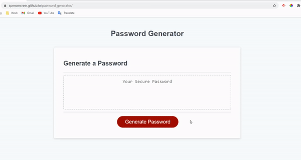

# password_generator
This application generates a random password based on criteria that the user selects.

When the user clicks the generate password button, then the user is prompted to enter a password length. The user then confirms the character types to include in the password. Once the user answers the prompts successfully, then a random password is generated based on the selected criteria. The password is printed to the screen.

## Links

URL: https://spencercreer.github.io/password_generator/

Repository: https://github.com/spencercreer/password_generator

## Animation

The following animation demonstrates the application functionality:

